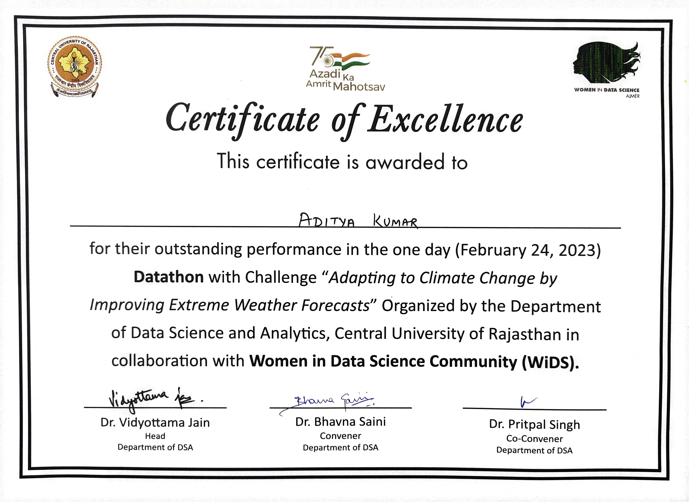

# About Project

This project is a Kaggle competition  Womans in data science Datathon 2023 that is about ***Adapting to Climate Change by Improving Extreme Weather Forecaststhat*** .

https://www.kaggle.com/competitions/widsdatathon2023/leaderboard

this is worldwide competition.

## Central University of Rajasthan, Ajmer

Central University of rajasthan orgenized this competition where 16 teams participated. My team was Team-G

* first time i handled huge dataset (3.75 lakh row and 246 columns).
* Handled missing values, categocial variables

## Model Training

* Used linear regression
* used Random Forest Regressor

* Used Xgboost Regressor
* used Lasso and got MSE of 1.1417 from kaggle submission

## Award

* We got 142 rank world wide
* we got rank 1 among 16 participation team.

# Rank 1 certificate

